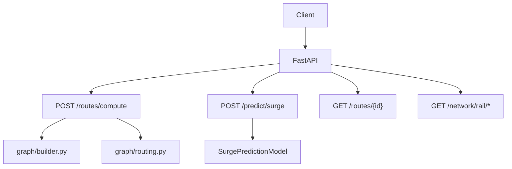

# Combined Surge + Routing API Plan

Unifies the lightweight surge inference API and the surge + routing extension into a single service design.

## Approach

- FastAPI + uvicorn service.
- Load `SurgePredictionModel` once for tabular surge inference.
- Build rail/road graph once from local data (`data/rail_*` etc.) via `src/graph/builder.py` + `src/graph/routing.py` (wrapped by `route_adapter.py`).
- Return routes as GeoJSON `FeatureCollection` with one `LineString` (compatible with `long-beach-to-fleet-yards-route.json` shape).

## Endpoints

- `GET /health`, `GET /ready`
- `POST /predict/surge`: pre-engineered feature rows + optional `horizon`
- `POST /routes/compute`: `{ origin:[lon,lat], destination:[lon,lat], mode:"rail"|"road"|"auto", optimize_for:"time"|"distance" }`
- `GET /routes/{id}`: serve saved GeoJSON route files
- `GET /network/rail/lines`, `GET /network/rail/nodes`: cached local GeoJSON slices (no live ArcGIS fetch on request path)

## Data flow

## Key files

- `src/api/server.py` – FastAPI app and routes.
- `src/graph/route_adapter.py` – graph loading + route computation to GeoJSON.
- `src/forecasting/surge_model.py` – surge model loading/predict.
- Saved routes (e.g., `long-beach-to-fleet-yards-route.json`) under project/data/public/output.

## Implementation steps

1) Build/load graph at startup; expose `compute_route` → LineString + metrics.

2) Expose API routes above; use surge model if available, otherwise readiness shows missing model.

3) Add/run dependencies: `fastapi`, `uvicorn[standard]`, `pydantic`; run `uvicorn src.api.server:app --reload --port 8000`.

4) Provide sample curl for surge predict and route compute (Long Beach → Fleet Yards/DAMCO example).